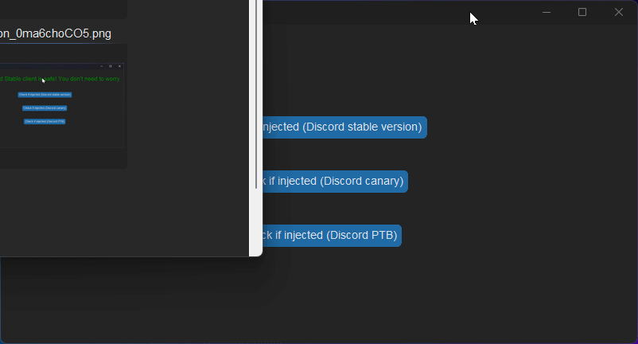

# Discord injection checker

[](https://discord.gg/Q6UYNawvaF)
  


### Star the repo if it helped you!

## Supports:
- Discord Stable
- Discord Canary
- Discord PTB

## How it works?

1. Injectors change a specific file (%localappdata%/discord/app-somenummbershere\modules\discord_desktop_core-1\discord_desktop_core\index.js) 
2. the program detects if it doesn't have the normal codes (betterdiscord injection is included in the codes list)
3. if the code is not in the codes list 
4. then you should reset password in browser and reinstall cliet 

## How to use?


1. clone in the repo: 
```sh
$ git clone https://github.com/happyendermangit/discord-injection-checker
```
2. install the required modules:
```sh
$ pip install customtkinter
```
3. run the program:
```sh 
$ python main.py
```
4. enjoy!

## What to do if your client is injected?

1. Reset password in browser NOT IN CLIENTT 
2. reinstall client (uninstall first, and install again) 
3. scan again using my tool just to be safe
4. 🎉no more injection 

Made by happy enderman™️